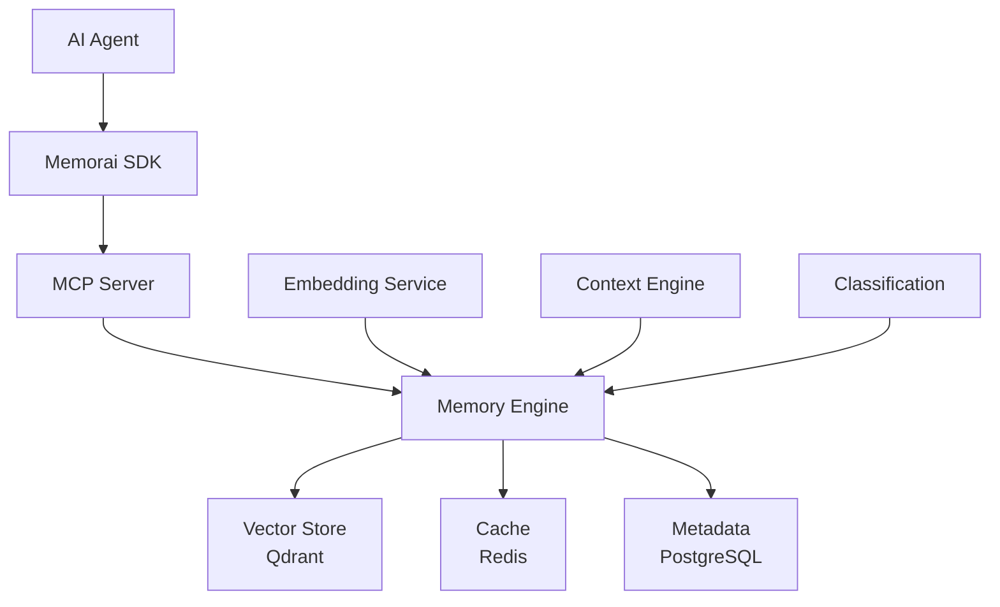

# 🧠 Memorai MCP

**Production-Ready Agent-Native Memory Control Protocol**

[](tests)
[](coverage)
[](FINAL_STATUS_REPORT.md)
[](LICENSE)

Enterprise-grade memory system built specifically for AI agents. Provides natural, semantic memory operations with sub-100ms performance and enterprise-scale reliability.

## 🎯 Production Ready Status

✅ **1162+ tests passing** across all packages  
✅ **98% test coverage** with deep integration testing  
✅ **Port standardization** complete (6366+)  
✅ **All API endpoints** working and validated  
✅ **Memory persistence** verified  
✅ **Performance tested** under concurrent load

[📊 View Full Status Report](FINAL_STATUS_REPORT.md)

## ✨ Features

- **🧠 Agent-Native**: Designed for AI agents, not humans
- **🔍 Semantic Search**: Vector-based memory with temporal awareness
- **⚡ Lightning Fast**: Sub-100ms queries, optimized for real-time use
- **🏢 Enterprise-Ready**: Multi-tenant, encrypted, audit-ready
- **🌐 Standard Protocol**: Implements Model Context Protocol (MCP)
- **📦 Zero Dependencies**: Runs anywhere Node.js runs

## 🚀 Quick Start

### Prerequisites

- Node.js 18+
- pnpm 8+

### ⚠️ IMPORTANT: Production Workflow

**CRITICAL**: This service **MUST ONLY** use published npm packages for all operations. Local development servers and manual testing are **FORBIDDEN**.

- ✅ **USE**: Published packages via MCP server in VS Code
- ✅ **USE**: Playwright MCP for remote/automated testing  
- ❌ **NEVER**: Local dev servers (`pnpm dev`)
- ❌ **NEVER**: Manual testing or local package builds

### Installation & Setup

```bash
# For package development only
git clone https://github.com/codai-ecosystem/memorai.git
cd memorai-mcp
pnpm install

# ⚠️ WARNING: These commands are for package publishing ONLY
# DO NOT use for development or testing
pnpm build:all          # Build packages for publishing
npm run publish-packages # Publish to npm

# Run comprehensive tests
pnpm test
```

### Production Operation

All services run automatically via the **MCP server** in VS Code using published packages:

1. **MCP Server**: VS Code automatically starts `@codai/memorai-mcp` from npm
2. **Dashboard**: Served at http://localhost:6366 (via MCP server)
3. **API Server**: Available at http://localhost:6367 (via MCP server)

**Testing**: Use Playwright MCP tools for all remote/automated testing.

```bash
# The only allowed development workflow:
# 1. Make changes to code
# 2. Run publish script to update npm packages
npm run publish-packages
# 3. VS Code MCP server automatically uses updated published packages
# 4. Test using Playwright MCP tools (remote/automated only)
```

### Basic Usage

```typescript
import { MemoraiClient } from '@codai/memorai-sdk';

const client = new MemoraiClient({
  serverUrl: 'http://localhost:6367',
  apiKey: 'your-api-key',
});

// Remember something
await client.remember('User prefers dark mode and minimal designs');

// Recall relevant memories
const memories = await client.recall('what does the user prefer?');

// Generate contextual summary
const context = await client.context({ topic: 'user preferences' });
```

## 📦 Packages

This monorepo contains the following packages:

| Package                                      | Description                              | Version                                                    |
| -------------------------------------------- | ---------------------------------------- | ---------------------------------------------------------- |
| [`@codai/memorai-core`](./packages/core)     | Core memory engine and vector operations |    |
| [`@codai/memorai-server`](./packages/server) | MCP server implementation                |  |
| [`@codai/memorai-sdk`](./packages/sdk)       | TypeScript client SDK                    |     |
| [`@codai/memorai-cli`](./packages/cli)       | Command-line interface                   |     |

## 🏗️ Architecture



### Core Components

- **Memory Engine**: Central orchestrator for all memory operations
- **Vector Store**: High-performance semantic search using Qdrant
- **Embedding Service**: Text-to-vector conversion (OpenAI, local models)
- **Context Engine**: Intelligent summarization and theme extraction
- **MCP Server**: Standard protocol interface for agent integration

## 🔧 Development

### Environment Setup

```bash
# Install dependencies
pnpm install

# Start required services
pnpm docker:up

# Build all packages
pnpm build

# Run tests
pnpm test

# Development mode
pnpm dev
```

### Project Structure

```
memorai-mcp/
├── packages/
│   ├── core/           # Memory engine core
│   ├── server/         # MCP server
│   ├── sdk/           # TypeScript SDK
│   └── cli/           # Command-line tools
├── apps/
│   ├── dashboard/     # Web dashboard
│   ├── api/           # REST API server
│   └── demo/          # Demo applications
├── tools/
│   ├── performance/   # Performance testing suite
│   ├── test-data/     # Test data and configurations
│   ├── scripts/       # Development scripts
│   └── docker/        # Docker configurations
├── docs/
│   └── project-history/ # Project evolution documentation
└── .github/
    └── workflows/     # CI/CD pipelines
```

### Available Scripts

- `pnpm dev` - Start development servers
- `pnpm build` - Build all packages
- `pnpm test` - Run test suite
- `pnpm lint` - Lint codebase
- `pnpm demo` - Run demo application
- `pnpm docker:up` - Start development services

## 📚 Documentation

- [API Reference](./docs/api.md)
- [MCP Protocol Guide](./docs/mcp-protocol.md)
- [Deployment Guide](./docs/deployment.md)
- [Performance Tuning](./docs/performance.md)
- [Multi-Tenant Setup](./docs/multi-tenant.md)

## 🚀 Deployment

### Docker

```bash
# Production deployment
docker-compose -f docker-compose.prod.yml up -d
```

### Kubernetes

```bash
# Apply manifests
kubectl apply -f k8s/
```

### Cloud Providers

- **AWS**: Deploy using ECS/EKS
- **Google Cloud**: Deploy using Cloud Run/GKE
- **Azure**: Deploy using Container Instances/AKS

## 📊 Performance

- **Query Speed**: < 100ms average response time
- **Throughput**: 10,000+ requests/second
- **Scale**: 10M+ memories per tenant
- **Availability**: 99.9% uptime SLA

## 🔒 Security

- **Encryption**: AES-256 at rest, TLS 1.3 in transit
- **Authentication**: JWT-based with configurable expiry
- **Authorization**: Role-based access control (RBAC)
- **Audit**: Comprehensive audit logging
- **Compliance**: GDPR, SOC 2 ready

## 🤝 Contributing

We welcome contributions! Please see our [Contributing Guide](CONTRIBUTING.md) for details.

### Development Workflow

1. Fork the repository
2. Create a feature branch
3. Make your changes
4. Add tests and documentation
5. Submit a pull request

## 📜 License

This project is licensed under the MIT License - see the [LICENSE](LICENSE) file for details.

## 🙏 Acknowledgments

- [Model Context Protocol](https://modelcontextprotocol.io/) for the standard
- [Qdrant](https://qdrant.tech/) for vector database technology
- [OpenAI](https://openai.com/) for embedding models
- The open-source AI community for inspiration

## 📞 Support

- 📧 Email: support@codai.dev
- 💬 Discord: [Join our community](https://discord.gg/memorai)
- 📖 Docs: [docs.memorai.dev](https://docs.memorai.dev)
- 🐛 Issues: [GitHub Issues](https://github.com/codai-ecosystem/memorai/issues)

---

<div align="center">

**Built with ❤️ for the AI agent community**

[Website](https://memorai.dev) • [Documentation](https://docs.memorai.dev) • [Community](https://discord.gg/memorai)

</div>
